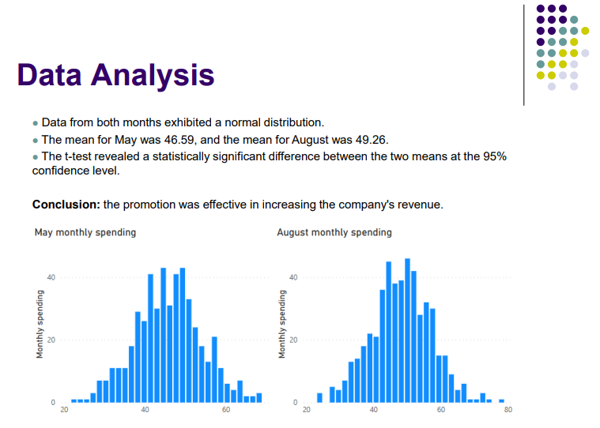
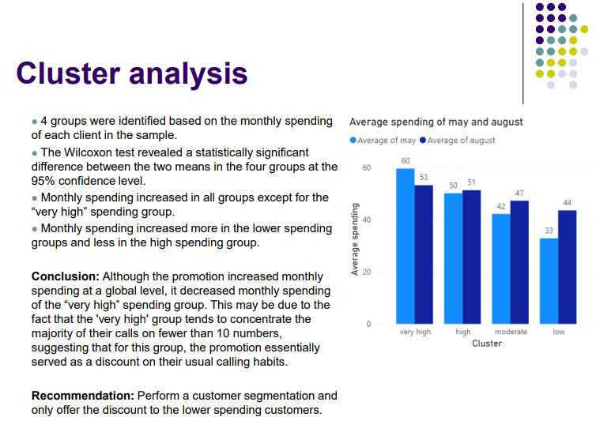

# Telecommunications Company Business Case

## Index

[01. problem statement](#01-problem-statement)

[02. Variables](#02-variables)

[03. Data analysis & clustering](#03-data-analysis--clustering)

[04. Power BI graphs](#04-power-bi-graphs)

[05. PPT Presentation](#05-ppt-presentation)

## 01. Problem statement

A telecommunications company implemented a promotion to boost its landline sales. The promotion offered a 50% discount on calls to 10 destinations of the customer's choice. The company hypothesized that by reducing the price of calls to 10 specific numbers, customers would increase their landline usage and potentially make more calls to non-discounted numbers. The promotion was rolled out in the second week of July to 130 customers, who were informed about the discount for their selected 10 numbers.

What was the impact of this strategy?

## 02. Variables

id: unique customer identifier

may: monthly bill in dollars for each customer in May 2014

august: monthly bill in dollars for each customer in August 2014

## 03. Data analysis & clustering

All the steps can be found with more detail in the python code.

Steps:
1. Data cleaning (check for duplicates, missing values and data inconsistency)
2. Data exploration (calculate the mean, standard deviation and other useful metrics)
3. Test normal distributions (with graphs and Shapiro test)
4. Perform T-test for paired samples
5. Create clusters with K-means method (also choose the optimal cluster number with elbow method)
6. Perform Wilcoxon test for the mean of each cluster (since the distribution of the clusters data was not normal, t-test could not be used)

## 04. Power BI graphs

In order to clearly present the findings, Power BI was used to build the graphs.

The file loaded in Power BI was exported from python with some columns added. Please see python code for details.

## 05. PPT Presentation

