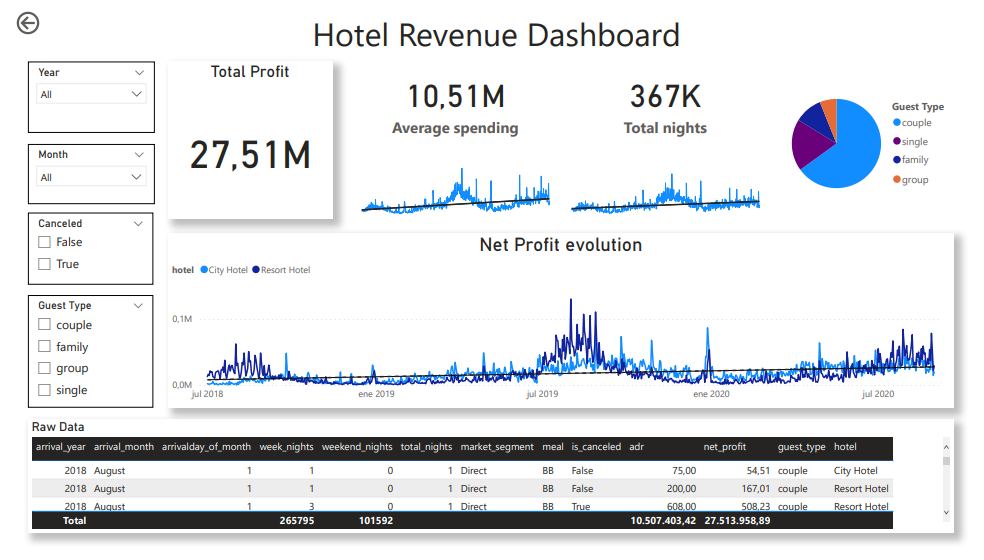

# Hotel Revenue project

In this project the dataset "hotel revenue" was analyzed using SQL and Power BI. All the files are accesible so that anyone can reproduce my analysis.

The file "hotel_revenue_full.xlsx" contains the original raw data. The csv files (uploaded to the "raw_data" folder) contains the data after the Data Preparation step.

## Steps

1. Data preparation (Excel)
2. SQL
   a. Database creation
   b. Data cleaning
   c. Data analysis
4. Dashboard creation (Power BI)

## Data Preparation

1. Split the original .xlsx file into 5 separate .csv files
2. Replace the "NULL" and "NA" values in the files with blank cells (using "replace" tool in Excel)
3. Change the "," in decimal numbers with "."
4. Change data format for YYYY-MM-DD (using "format cell" tool)
5. Check which number columns in the files contains empty cells (this will be important when updalong the data to the SQL database)

## SQL

The following files can be found in the SQL folder:
1. hotel_revenue_database_definition: conatins the script with the database definition
2. hotel_revenue_data_load: cointains the script to load the data into the database (make sure to select the folder path where you saved the raw data)
3. hotel_revenue_cleaning: contains the data cleaning querys of this project
4. hotel_revenue_working_querys: contains the script with the analysis of the dataset.

All the files contain explanations of the steps followed. 

## Power BI Dashboard

### Tables Connections

[Hotel_revenue market_segment](segment) -> [Hotel_revenue revenue_total](market_segment)
[Hotel_revenue meal_cost](meal) -> [Hotel_revenue revenue_total](cost)

### Measures and calculated columns

1. Measure - NetProfit

2. Column - Date

3. Column - NetProfit_column

4. Column - total_nights
